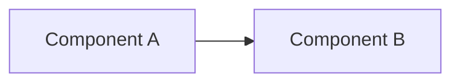

# Adaptive Docs - Init

Set up the adaptive documentation system in a project. This is the **mechanical bootstrap** - it creates the structure but doesn't try to refactor existing sprawl. Use `/adaptive-docs-extract` for that after.

The system is **agent-agnostic**: `AGENTS.md` is the primary root file (universal standard, supported by Codex / Cursor / Windsurf / Aider, and read by Claude Code as a fallback). `CLAUDE.md` is optional and only created if the user wants Claude Code-specific additions.

The architecture being installed:

```
<project>/
├── AGENTS.md                 # always loaded, agent-agnostic root (primary)
├── docs/ai/                  # on-demand reference docs (the source of truth)
│   ├── README.md
│   └── writing-docs.md       # meta-rules for editing these
├── .agents/skills/           # auto-activated skills (shared between agents)
└── .claude/skills            # symlink → ../.agents/skills
```

See `~/.claude/templates/adaptive-docs/` for the templates this skill uses.

## Steps

### 1. Verify environment

Confirm we're in a git repository and at the project root:

```bash
git rev-parse --show-toplevel
```

If not in a git repo, ask the user whether to proceed anyway or `git init` first.

Detect project name from `package.json`, `pyproject.toml`, `Cargo.toml`, or the directory name as fallback.

### 2. Detect what already exists

Check for each piece of the system:

```bash
test -f AGENTS.md            && echo "HAS_AGENTS_MD"
test -f CLAUDE.md            && echo "HAS_CLAUDE_MD"
test -d docs/ai              && echo "HAS_DOCS_AI"
test -d .agents/skills       && echo "HAS_AGENTS_SKILLS"
test -L .claude/skills       && echo "HAS_SKILLS_SYMLINK"
test -f docs/ai/writing-docs.md && echo "HAS_WRITING_DOCS"
```

For each missing piece, plan to create it. For each existing piece, **do not overwrite** - instead report and skip. The user can run `/adaptive-docs-extract` to refactor existing files.

### 3. Create directory structure

```bash
mkdir -p docs/ai
mkdir -p .agents/skills
mkdir -p .claude
```

### 4. Create the symlink

`.claude/skills` is a relative symlink to `../.agents/skills` so both paths resolve to the same directory:

```bash
[ -L .claude/skills ] || ln -s ../.agents/skills .claude/skills
```

If `.claude/skills` exists as a real directory (not a symlink), stop and ask the user how to proceed - they may have skills they don't want to lose.

### 5. Update .gitignore

The `.claude/` directory is often gitignored (it has worktrees, ports, settings). But `.claude/skills` (the symlink) and `.claude/settings.json` should usually be tracked.

Read `.gitignore`. If it has a bare `.claude/` or `.claude` rule, replace with:

```
.claude/*
!.claude/skills
!.claude/settings.json
```

If `.gitignore` doesn't mention `.claude/` at all, add the same block. If it already has the exception form, leave it alone.

### 6. Create docs/ai/writing-docs.md

Copy `~/.claude/templates/adaptive-docs/writing-docs.md.template` to `docs/ai/writing-docs.md`. Replace template placeholders with empty strings (the inventory tables will be filled in as docs are added):

- `{{FILE_TABLE_ROWS}}` → empty (just the header row remains)
- `{{SKILL_TABLE_ROWS}}` → empty
- `{{NESTED_AGENTS_ROWS}}` → empty

### 7. Create docs/ai/README.md

Copy `~/.claude/templates/adaptive-docs/README.md.template` to `docs/ai/README.md`. Replace `{{FILE_TABLE_ROWS}}` with empty (the table will list new docs as they're added).

### 8. Create root AGENTS.md (if missing)

This is the **primary root file**. Copy `~/.claude/templates/adaptive-docs/AGENTS.md.template` to `AGENTS.md` at the project root.

Replace placeholders:
- `{{PROJECT_NAME}}` → detected project name
- `{{TECH_STACK_DESCRIPTION}}` → empty or one line if obvious from `package.json`
- `{{REFERENCE_TABLE_ROWS}}` → empty (to be filled in as docs are added)

If `AGENTS.md` already exists, **do not overwrite**. Report it and tell the user that `/adaptive-docs-extract` can help align it with the structure.

### 8b. Optionally scaffold `docs/ai/architecture.md` with a mermaid placeholder

If the project has a clear architecture worth diagramming (multiple services, a meaningful request flow, or distinct layers), ask the user if they want a starter `docs/ai/architecture.md` scaffold. If yes (or if the user already opted in), create the file with:

- The banner header (standard `docs/ai/` re-read banner)
- An H1 title
- An empty mermaid fenced block as a placeholder, with a TODO comment
- A short prompt for the user describing next steps

Example starter content:

````markdown
> **IMPORTANT: Before reading, check if you already read this file earlier in this session. If yes, skip the read and announce "Context already loaded: architecture.md (re-using from earlier)". If no, read it and announce "Context loaded: architecture.md".**

# Architecture



Fill in the components, data flow, and any external dependencies. See `docs/ai/writing-docs.md` for mermaid guidance.
````

Do **not** auto-generate the diagram content - understanding the project's real shape is too project-specific for a template. The scaffold only creates the slot.

Skip this step entirely if the project is tiny (single-file CLI, one-script tool) where a diagram adds no value.

If `docs/ai/architecture.md` already exists, **do not overwrite**.

### 9. Do NOT create CLAUDE.md

By default, skip `CLAUDE.md`. Claude Code reads `AGENTS.md` as a fallback when no `CLAUDE.md` exists, so it works fine without one.

**Only create `CLAUDE.md` if the user explicitly asks for it** (e.g. they have Claude-specific hooks, `/command` aliases, or custom Claude Code settings). In that case, create a thin pointer:

```markdown
# {{PROJECT_NAME}} - Claude Code-specific config

See `AGENTS.md` for universal instructions. This file contains Claude Code-specific additions only.

## Claude-specific commands

(Add `/command` aliases, hook configs, or Claude Code-only workflows here.)
```

Do not copy the full universal rules into CLAUDE.md. Duplication creates drift.

### 10. Report what was done

Print a summary like:

```
Adaptive docs initialized (agent-agnostic).

Created:
  ✓ docs/ai/README.md
  ✓ docs/ai/writing-docs.md
  ✓ docs/ai/architecture.md (optional, starter scaffold with mermaid placeholder)
  ✓ AGENTS.md (primary root file - read by all agents)
  ✓ .agents/skills/ (empty)
  ✓ .claude/skills → ../.agents/skills (symlink)
  ✓ .gitignore updated to track .claude/skills

Not created (by design):
  - CLAUDE.md  (AGENTS.md covers Claude Code too via fallback;
                add a CLAUDE.md only if you need Claude-specific config)

Next steps:
  - Fill in AGENTS.md with your project's tech stack and hard rules.
  - Add topic docs to docs/ai/ as you encounter recurring guidelines.
  - Read docs/ai/writing-docs.md to understand the maintenance rules.

For other agents:
  - GitHub Copilot: copy the AGENTS.md reference table to .github/copilot-instructions.md
  - ChatGPT / other chat agents: paste relevant docs/ai/ files per conversation
```

## Notes

- **This skill is idempotent.** Running it twice should not break anything - it skips files that already exist.
- **Templates are at `~/.claude/templates/adaptive-docs/`.** If the templates are missing (e.g. user doesn't have these dotfiles), bail with a clear message instead of inventing content.
- **Do not invent content for placeholders.** If you don't have a real value (e.g. tech stack), leave a clear comment like `<!-- TODO: fill in tech stack -->` so the user knows to come back.
- **Don't run /adaptive-docs-extract automatically.** It's interactive and the user may want to do it later.
- **AGENTS.md is the standard.** Don't default to CLAUDE.md - that encourages Claude-specific thinking that breaks the agent-agnostic goal.
