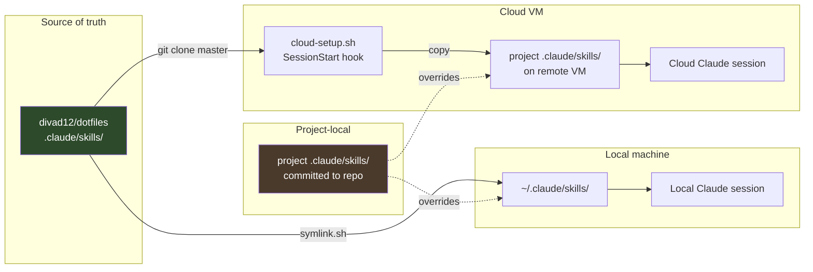
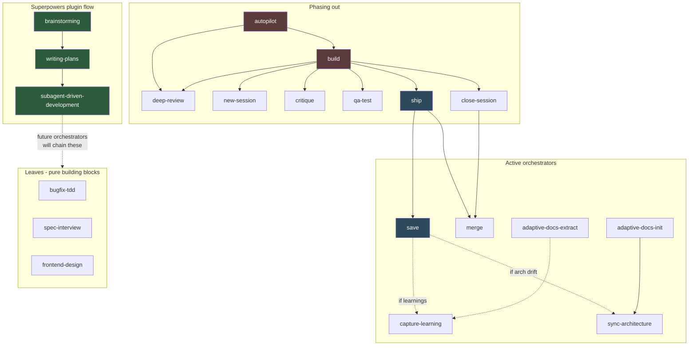

# Dotfiles: Agent Skills

This repo hosts my global Claude Code skills (and agent-agnostic rules) at `.claude/skills/`. They get symlinked into `~/.claude/skills/` by `symlink.sh` and are also cloned by the cloud-session setup hook in other projects, so changes here propagate everywhere.

**Recent session handoffs** live in `handoffs/` with date-prefixed filenames. Read the latest one before picking up skill work - it captures the nuances and rationale that don't make it into the skills themselves.

## Layout

```
.claude/
├── AGENTS.md              # Universal agent rules (CLAUDE.md is a symlink to this)
├── CLAUDE.md -> AGENTS.md # One source of truth
├── settings.json          # Global settings (enabled plugins, permissions)
├── commands/              # Slash command definitions
├── templates/             # Templates used by skills
└── skills/                # Custom skills
    ├── build/             # Autonomous feature build: worktree + impl + critique + review
    ├── bugfix-tdd/        # Write failing test from symptom FIRST, then investigate
    ├── capture-learning/  # Route session insights into project docs
    ├── close-session/     # Teardown: merge, stop server, delete worktree + branch
    ├── critique/          # Visual UI/UX critique via Playwright MCP
    ├── deep-review/       # 6-way parallel review: audit + diff + rules + simplify + codex + UI
    ├── merge/             # Rebase onto local main, fast-forward
    ├── new-session/       # Spin up a worktree with env files + unique port
    ├── qa-test/           # Browser-only QA agent, no source access
    ├── save/              # Update PROGRESS.md, TECH_DEBT.md, route learnings
    ├── ship/              # Save + commit + merge in one go
    ├── spec-interview/    # Deep interview -> docs/specs/YYYY-MM-DD-<feature>.md
    ├── frontend-design/   # Distinctive, production-grade UI generation
    ├── autopilot/         # Parallel worktree agents for independent tasks
    ├── adaptive-docs-*/   # Set up / refactor the docs/ai/ system in a project
    ├── sync-architecture/ # Keep architecture docs in sync
    ├── superpowers/       # Compatibility shim for shared skills
    └── playwright-cli/    # Browser automation via Playwright
```

## How the skills are distributed

Three paths, all fed from this repo:

1. **Local (symlink):** `symlink.sh` links `~/.claude/skills/` -> `.claude/skills/` in this repo. Any edit here takes effect immediately for local Claude Code sessions.
2. **Cloud sessions:** A setup hook in project repos (e.g. Journology's `.claude/hooks/cloud-setup.sh`) clones `https://github.com/divad12/dotfiles.git` and copies `.claude/skills/*` into the cloud session's project skills dir. **Push to master for cloud sessions to pick up changes.**
3. **Inline in projects:** Projects can also commit their own `.claude/skills/` for project-specific skills that override globals.



**Key asymmetry:** local sees edits instantly (symlink). Cloud sees them only after push to master. When iterating rapidly, test locally first.

## Current direction: superpowers-based orchestration

**Active workflow (what I'm using now):**

1. `superpowers:brainstorming` - explore intent, requirements, design before implementation
2. `superpowers:writing-plans` - turn the brainstorm into a plan with review checkpoints
3. `superpowers:subagent-driven-development` - execute the plan via dispatched subagents

**Planning to build on top:** project-specific orchestrator skills that chain into these superpowers skills rather than the monolithic `build` / `autopilot` flow below.

**Being phased out:** `build` and `autopilot` - both tried to do too much in one skill and don't compose well with plan-driven flows. Leaves (`critique`, `deep-review`, `qa-test`, `new-session`, etc.) stay - they're useful building blocks for any orchestrator.

## Skill invocation graph

Which skills invoke which. Solid arrows = direct invocation (skill A reads skill B's SKILL.md and follows its steps inline). Dotted = triggered externally (e.g. `save` calls `capture-learning` when the session produced learnings).



**Active orchestrators** (blue): `ship`, `save` - still in daily use.
**Superpowers flow** (green): `brainstorming` -> `writing-plans` -> `subagent-driven-development`. Future project-specific skills will plug into this pipeline.
**Phasing out** (red): `build`, `autopilot` - kept in repo for now but not being invoked.
**Leaves**: pure, no invocations out. Safe to edit without worrying about cascading effects. These are the useful building blocks that survive the migration.

**Important:** Claude's Skill tool can't be called from within another skill. So "invokes" means "reads the target's SKILL.md and follows its steps inline in the same conversation." If you change a leaf skill's interface, update every orchestrator that invokes it.

## Key architectural decisions

### Skills own their workflow, CLAUDE.md stays thin

CLAUDE.md (= AGENTS.md) only holds pointers. Detailed workflow lives inside each skill. So "how to save progress" lives in `save/SKILL.md`, not in CLAUDE.md. This keeps the root instruction budget small and lets skills evolve without bloating global context.

### Skills can invoke other skills inline (not via the Skill tool)

Claude's Skill tool can't be called from inside another skill. So `build` reads `critique/SKILL.md` and follows its steps inline. When editing a skill that's invoked by another, the invoking skill's reference needs to stay in sync.

### Never auto-ship

Skills NEVER run `/ship` automatically. Only the user decides when to ship. This is enforced in `build`, `autopilot`, and any skill that presents "next step" options via AskUserQuestion.

### Worktree session isolation with atomic port locks

`new-session` and `close-session` use **lock files per port** (`.claude/ports/3001` containing the branch name) to avoid race conditions between parallel worktrees. Port 3000 is permanently reserved for the main repo.

### TDD is symptom-first

`bugfix-tdd` forbids investigating the code before writing the failing test. Reason: if you investigate first, you write a test that targets the specific cause you found (too narrow). Symptom-first tests are behavioral - they guard against the whole class of bugs, including future causes.

### Deep review: fix everything, always

`deep-review` has no "maybe defer" category. Every finding from every reviewer (simplify, codex, UI, rule compliance, collateral audit, Claude's own pass) gets auto-fixed unless it's genuinely massive work (new tables, new endpoints, multi-file architecture change). "Out of scope" and "debatable" are NOT reasons to skip a fix.

## Common editing tasks

### Edit a skill's behavior

Edit `.claude/skills/<name>/SKILL.md` directly. Local sessions see it immediately (symlink). Commit + push for cloud sessions.

### Add a new skill

1. Create `.claude/skills/<name>/SKILL.md` with YAML frontmatter:
   ```yaml
   ---
   name: <name>
   description: "What it does. Triggers: '<trigger phrase>', '<another>'."
   user-invocable: true        # omit if only other skills should invoke it
   argument-hint: [optional arg description]
   ---
   ```
2. Write steps, rules, anti-patterns sections.
3. If other skills need to invoke it, reference it by name in their SKILL.md (e.g., "run the `/critique` skill").

### Add a global rule that applies everywhere

Edit `.claude/AGENTS.md`. Keep it short - only truly universal principles belong there. Project-specific rules go in each project's `CLAUDE.md` or `docs/ai/`.

### Update settings or permissions

Edit `.claude/settings.json`. Currently uses `bypassPermissions` mode with wildcard allow rules for all tool types + MCP.

## Workflow for iterating on skills

1. Make the edit in `.claude/skills/<name>/SKILL.md`
2. Test it in the real project (Journology or wherever)
3. If the edit produced friction or drift, tighten the wording
4. Commit + push. Format: `<skill-name>: <what changed and why>`

Common iteration patterns that came up:
- **Stop signals:** Explicit "if you catch yourself thinking X, STOP" lists inside skills. More effective than general exhortations.
- **Pre-flight checks:** Re-read applicable rules before each implementation (not just at session start).
- **Deferral anti-patterns:** Watch for "for now I'll just...", "I'll come back to this..." as silent shortcut signals.
- **Self-contained prompts for AskUserQuestion:** Include URLs, summaries, and test instructions directly in the question text - the conversation behind the dialog is hidden/greyed.

## What NOT to do

- Don't bloat `.claude/AGENTS.md` with project-specific rules. Universal only.
- Don't let skills duplicate workflow logic. Reference shared steps inline if a skill is invoked.
- Don't auto-commit or auto-ship from skills. User decides.
- Don't add `/save` cleanup as a footgun - it should update files in place, not append per-session sections.
- Don't edit `.claude/CLAUDE.md` - it's a symlink. Edit `.claude/AGENTS.md`.
